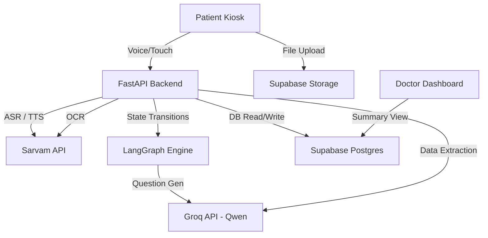

# MediKiosk System Architecture

## High-Level Data Flow

1. **Patient Interface (Frontend)**
   - Built on Next.js 14 App Router.
   - Dual-input mode: The user can interact using standard touch UI or via the Web Speech API / WebRTC for voice.
   - Authentication is handled seamlessly by Supabase Auth (Google OAuth).
   
2. **Conversation Orchestration (Backend - LangGraph)**
   - The heart of the conversational AI lives in `backend/app/agent/graph.py`.
   - **LangGraph** manages a cyclic state machine (`InterviewState`) containing current findings (Chief Complaint, HPI, Past History, Red Flags).
   - Each state transition invokes **Qwen 3.3 27B** (via Groq API) to generate the next logical question in the appropriate language.
   - User voice inputs are passed to **Sarvam AI (Saarva)** for ASR transcription, fed back into LangGraph, and responses are converted to speech via Sarvam TTS.

3. **Ayush Extension (Dashavidha Pariksha)**
   - A specialized module that sidesteps the unstructured LLM graph for highly standardized Ayurvedic profiling.
   - Answers dictate *Dosha* (Vata/Pitta/Kapha) scores and *Vaya* (Age stage), culminating in a single dominant *Prakriti*.
   
4. **Document Processing (OCR & Extraction)**
   - Patients upload PDFs or Images directly to **Supabase Storage**.
   - The backend triggers **Sarvam AI (Bulbul v3)** for raw OCR.
   - A structured LLM pass (using GPT OSS models via Groq) coerces the raw text into Pydantic models for Diagnoses, Medications, and Lab Results.

## Sub-System Interactions

